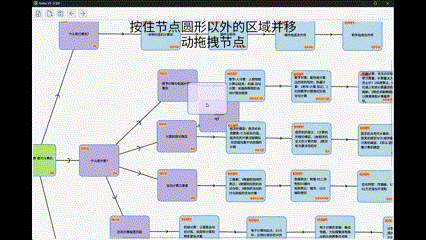
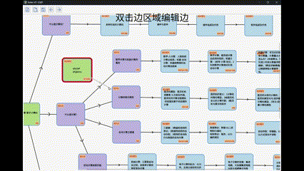
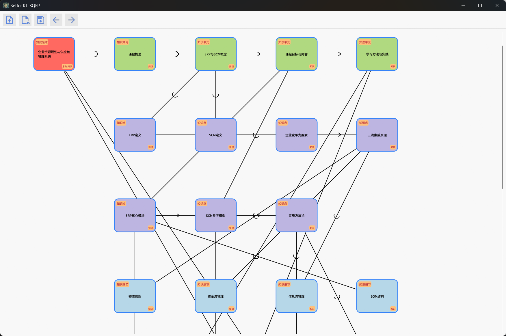
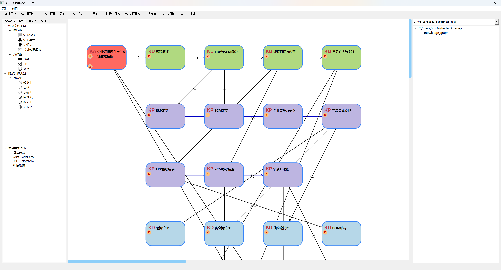

# 使用方式

1. 使用软件；
2. 使用 Python 绑定；

## 使用软件

新建文件：


打开文件：


移动：


缩放：


新建节点：


添加边：


改变节点位置：



编辑节点内容：


编辑边：



删除节点和边：


撤销与恢复：


显式保存：


## 使用 Python 绑定

在 [下载页面](https://github.com/zmsbruce/better_kt_sqep/releases) 中下载 Wheel 文件，之后使用 `pip install` 进行安装。

```python
from py_better_kt_sqep import KnowledgeGraph

# 初始化一个知识图谱
kg = KnowledgeGraph()

# 添加节点
#
# 参数：
# - content：节点内容
# - distinct_type：独立实体类型，分别是 ka (知识领域)、ku (知识单元)、kp (知识点)、kd (知识细节)
# - addon_types：附加实体类型，为 k (知识)、t (思维)、e (示例)、q (问题)、p (练习)、z (思政) 的组合
# - x：横坐标
# - y：纵坐标
#
# 返回：节点 id
entity_1 = kg.add_entity("这里是节点一", "ka", "kte", 0.0, 100.0)
entity_2 = kg.add_entity("这里是节点二", "ka", "kte", 100.0, 100.0)

# 添加边
#
# 参数：
# - from：边开始的节点 id
# - to：边指向的节点 id
# - relation：关系，为 contain (包含) 或者 order 次序
kg.add_edge(entity_1, entity_2, "contain")

# 删除边
#
# 参数：
# - from：边开始的节点 id
# - to：边指向的节点 id
kg.remove_edge(entity_1, entity_2)

# 删除节点
#
# 参数：
# - id：节点 id
kg.remove_entity(entity_2)

# 导出为 XML
#
# 返回：XML 字符串
xml = kg.to_xml()
```

### 使用 AI 和 Python 绑定

以 [豆包](https://www.doubao.com/chat/) 为例，开启深度思考，在聊天中添加文件并输入下面的内容：

```txt
将文件的内容转为知识图谱的形式，并保存为 XML 文件，文件名为 knowledge_graph.xml。要求有 40 个节点以上，每个节点之间距离为 300 以上，节点安排合理，不要有重叠，具有知识图谱的可阅读性。节点横坐标纵坐标必须大于 200，构建知识图谱的代码如下，要严格按照代码的 API 进行编写，关系必须同时存在 contain 和 order：
from py_better_kt_sqep import KnowledgeGraph

# 初始化一个知识图谱
kg = KnowledgeGraph()

# 添加节点
#
# 参数：
# - content：节点内容
# - distinct_type：独立实体类型，分别是 ka (知识领域)、ku (知识单元)、kp (知识点)、kd (知识细节)
# - addon_types：附加实体类型，为 k (知识)、t (思维)、e (示例)、q (问题)、p (练习)、z (思政) 的组合
# - x：横坐标
# - y：纵坐标
#
# 返回：节点 id
entity_1 = kg.add_entity("这里是节点一", "ka", "kte", 200.0, 200.0)
entity_2 = kg.add_entity("这里是节点二", "ka", "kte", 400.0, 200.0)
entity_3 = kg.add_entity("这里是节点三", "ka", "kte", 200.0, 400.0)

# 添加边
#
# 参数：
# - from：边开始的节点 id
# - to：边指向的节点 id
# - relation：关系，为 contain (包含) 或者 order (次序)
kg.add_edge(entity_1, entity_2, "contain")
kg.add_edge(entity_1, entity_3, "order")

# 导出为 XML 字符串
#
# 返回：XML 字符串
xml_string = kg.to_xml()
```

以2020ERP&SCM第1讲-引论为例，AI 返回代码如下：

```python
from py_better_kt_sqep import KnowledgeGraph

kg = KnowledgeGraph()

# 课程核心知识领域
entity_ka = kg.add_entity("企业资源规划与供应链管理系统", "ka", "kz", 200.0, 200.0)

# 第一部分：课程概述
entity_ku1 = kg.add_entity("课程概述", "ku", "k", 500.0, 200.0)
entity_ku2 = kg.add_entity("ERP与SCM概念", "ku", "k", 800.0, 200.0)
entity_ku3 = kg.add_entity("课程目标与内容", "ku", "k", 1100.0, 200.0)
entity_ku4 = kg.add_entity("学习方法与实践", "ku", "k", 1400.0, 200.0)

# 第二部分：核心概念分解
entity_kp1 = kg.add_entity("ERP定义", "kp", "k", 500.0, 500.0)
entity_kp2 = kg.add_entity("SCM定义", "kp", "k", 800.0, 500.0)
entity_kp3 = kg.add_entity("企业竞争力要素", "kp", "k", 1100.0, 500.0)
entity_kp4 = kg.add_entity("三流集成原理", "kp", "k", 1400.0, 500.0)

# 第三部分：课程内容体系
entity_kp5 = kg.add_entity("ERP核心模块", "kp", "k", 500.0, 800.0)
entity_kp6 = kg.add_entity("SCM参考模型", "kp", "k", 800.0, 800.0)
entity_kp7 = kg.add_entity("实施方法论", "kp", "k", 1100.0, 800.0)

# 第四部分：关键知识点
entity_kd1 = kg.add_entity("物流管理", "kd", "k", 500.0, 1100.0)
entity_kd2 = kg.add_entity("资金流管理", "kd", "k", 800.0, 1100.0)
entity_kd3 = kg.add_entity("信息流管理", "kd", "k", 1100.0, 1100.0)
entity_kd4 = kg.add_entity("BOM结构", "kd", "k", 1400.0, 1100.0)
entity_kd5 = kg.add_entity("MRP算法", "kd", "k", 500.0, 1400.0)
entity_kd6 = kg.add_entity("SCOR模型", "kd", "k", 800.0, 1400.0)
entity_kd7 = kg.add_entity("成本核算方法", "kd", "k", 1100.0, 1400.0)
entity_kd8 = kg.add_entity("系统集成技术", "kd", "k", 1400.0, 1400.0)

# 第五部分：实践能力培养
entity_kd9 = kg.add_entity("软件配置", "kd", "k", 500.0, 1700.0)
entity_kd10 = kg.add_entity("业务流程建模", "kd", "k", 800.0, 1700.0)
entity_kd11 = kg.add_entity("数据标准化", "kd", "k", 1100.0, 1700.0)
entity_kd12 = kg.add_entity("项目管理", "kd", "k", 1400.0, 1700.0)

# 第六部分：典型案例分析
entity_kd13 = kg.add_entity("制造业应用", "kd", "ke", 500.0, 2000.0)
entity_kd14 = kg.add_entity("零售业应用", "kd", "ke", 800.0, 2000.0)
entity_kd15 = kg.add_entity("物流企业案例", "kd", "ke", 1100.0, 2000.0)

# 第七部分：前沿技术
entity_kd16 = kg.add_entity("智能ERP", "kd", "k", 500.0, 2300.0)
entity_kd17 = kg.add_entity("区块链供应链", "kd", "k", 800.0, 2300.0)
entity_kd18 = kg.add_entity("大数据分析", "kd", "k", 1100.0, 2300.0)

# 第八部分：思政元素
entity_kd19 = kg.add_entity("企业社会责任", "kd", "kz", 1400.0, 2000.0)
entity_kd20 = kg.add_entity("可持续发展理念", "kd", "kz", 1400.0, 2300.0)

# 建立层次关系
kg.add_edge(entity_ka, entity_ku1, "contain")
kg.add_edge(entity_ka, entity_ku2, "contain")
kg.add_edge(entity_ka, entity_ku3, "contain")
kg.add_edge(entity_ka, entity_ku4, "contain")

kg.add_edge(entity_ku2, entity_kp1, "contain")
kg.add_edge(entity_ku2, entity_kp2, "contain")
kg.add_edge(entity_ku3, entity_kp5, "contain")
kg.add_edge(entity_ku3, entity_kp6, "contain")
kg.add_edge(entity_ku4, entity_kd9, "contain")
kg.add_edge(entity_ku4, entity_kd10, "contain")

# 建立顺序关系
kg.add_edge(entity_ku1, entity_ku2, "order")
kg.add_edge(entity_ku2, entity_ku3, "order")
kg.add_edge(entity_ku3, entity_ku4, "order")

kg.add_edge(entity_kp1, entity_kp3, "order")
kg.add_edge(entity_kp3, entity_kp4, "order")
kg.add_edge(entity_kp5, entity_kp6, "order")
kg.add_edge(entity_kp6, entity_kp7, "order")

# 建立知识点关联
kg.add_edge(entity_kp4, entity_kd1, "contain")
kg.add_edge(entity_kp4, entity_kd2, "contain")
kg.add_edge(entity_kp4, entity_kd3, "contain")
kg.add_edge(entity_kp5, entity_kd4, "contain")
kg.add_edge(entity_kp5, entity_kd5, "contain")
kg.add_edge(entity_kp6, entity_kd6, "contain")
kg.add_edge(entity_kp7, entity_kd7, "contain")
kg.add_edge(entity_kp7, entity_kd8, "contain")

# 建立实践关联
kg.add_edge(entity_kd9, entity_kd13, "contain")
kg.add_edge(entity_kd10, entity_kd14, "contain")
kg.add_edge(entity_kd11, entity_kd15, "contain")

# 建立前沿关联
kg.add_edge(entity_kd8, entity_kd16, "contain")
kg.add_edge(entity_kd8, entity_kd17, "contain")
kg.add_edge(entity_kd8, entity_kd18, "contain")

# 建立思政关联
kg.add_edge(entity_ka, entity_kd19, "contain")
kg.add_edge(entity_ka, entity_kd20, "contain")

# 导出知识图谱
xml_string = kg.to_xml()

# 保存到文件
with open("knowledge_graph.xml", "w", encoding="utf-8") as f:
    f.write(xml_string)
```

在 better_kt_sqep 中如下：



在 KT-SQEP 中如下：


